# Схема взаимодействия сервисов (Распознавание и Фидбэк)

Ниже представлена диаграмма последовательности, иллюстрирующая весь реализованный нами цикл: от отправки клиентом картинки до автоматического закрытия задачи по тайм-ауту (через 30 минут) или получения отредактированного ответа.

```mermaid
sequenceDiagram
    autonumber
    actor Client as Клиент (Фронтенд)
    participant Spring as solution_archive-service (Spring)
    participant MinIO as MinIO Storage
    participant DB as PostgreSQL
    participant OCR as latexOCR (Python)
    participant Rabbit as RabbitMQ

    %% Phase 1: Initiation
    rect rgb(30, 41, 59)
    note right of Client: Этап 1: Старт Распознавания
    Client->>Spring: POST /api/v1/recognition/process (Файл: картинка)
    Spring->>MinIO: Сохранить картинку в бакет "temp-images"
    MinIO-->>Spring: ОК (получен imagePath)
    Spring->>DB: INSERT Task (Статус: RECOGNIZING)
    Spring->>OCR: POST /api/v1/ocr (Пересылка картинки)
    OCR-->>Spring: 202 Accepted { "task_id": "abc-123" }
    Spring->>DB: UPDATE Task (Сохраняем latexOcrTaskId = "abc-123")
    Spring-->>Client: Возвращаем Task ID клиенту
    end

    %% Phase 2: Async Processing
    rect rgb(31, 41, 55)
    note right of Client: Этап 2: Асинхронное распознавание (Скрыто от клиента)
    OCR->>OCR: Работает Celery Воркер (pix2tex infer)
    OCR->>Rabbit: [Exchange: ocr.events] Публикация результата успеха/ошибки
    Rabbit->>Spring: @RabbitListener вызывает processOcrResult()
    Spring->>DB: UPDATE Task (Статус: READY_FOR_FEEDBACK, дедлайн + 30 мин)
    Spring->>Rabbit: Отправляем таску в Delay Queue (TTL = 30 минут)
    end

    %% Phase 3: Wait / Feedback
    rect rgb(15, 23, 42)
    note right of Client: Этап 3: Ожидание 30 минут / Фидбэк пользователя
    
    alt Клиент прислал правки
        Client->>Spring: POST /api/v1/recognition/{id}/feedback (edited_result)
        Spring->>DB: UPDATE Task (Статус: COMPLETED_EDITED, сохраняем правки)
        Spring->>MinIO: Копируем из "temp-images" в "dataset-images"
        Spring->>MinIO: Удаляем из "temp-images"
        Spring-->>Client: 200 OK (сохранено)
    else Прошло 30 минут (Пользователь не прислал правки)
        Rabbit-->>Rabbit: TTL истёк! Message падает в Dead Letter Queue (DLQ)
        Rabbit->>Spring: @RabbitListener ловит истёкшее сообщение
        Spring->>DB: Проверка: Статус всё ещё READY_FOR_FEEDBACK?
        Spring->>DB: UPDATE Task (Статус: COMPLETED_AUTO)
        Spring->>MinIO: Просто удаляем картинку из "temp-images" (она не нужна для дообучения)
    end
    end
```

